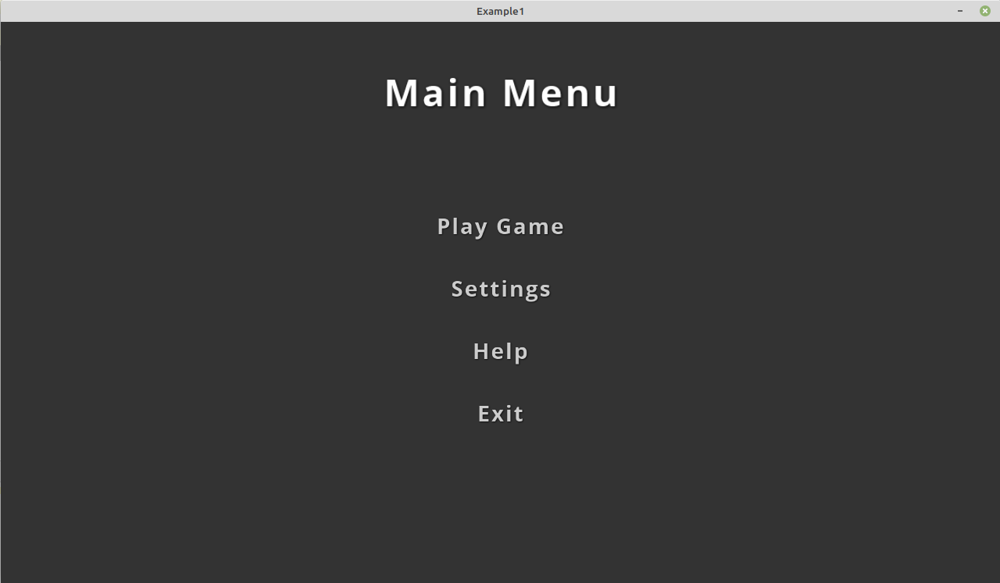

# GalagoUI
GalagoUI is a simple framework for creating game GUI in jMonkeyEngine. 
It gives the user a variety of UI widgets and a framework for creating screens, buttons, labels, screen flows and much more.

**Some features this library provides:**
1. A GalagoApplication that you have to extend which will control the screens and flow.
2. An AbstractScreen which you extend and register with your application.
3. Different components/widgets which you can add on a screen for behaviour.
4. Listeners which you add to buttons can widgets to detect user input.
5. Different managers for handling sound, effects, textures, fonts, messages, models and screen flow.
6. Panels for grouping widgets.
7. A game state system for handling saving of game progress and user data to the user's PC profile.
8. Integrated tween system for creating nice visual animations. This makes use of the "universal-tween-engine-6.3.3.jar" so make sure to include it.

## Example1:
Let's start with a very simple example.
In this example I will show you how to create the application, 2 screens and some components on the screen.

### MainApplication

```java
package com.galago.ui.examples;

import com.galago.ui.app.GalagoApplication;
import com.galago.ui.managers.*;
import com.jme3.math.ColorRGBA;

import java.io.IOException;

/**
 * In this Example1 I will show you the basic structure of a game created with GalagoUI framework.
 * It helps a lot with things you normally had to handle your self.
 * Such as a UI framework with widgets that scale automatically with the screen or window size.
 */
public class Example1 extends GalagoApplication {

  /**
   * This is the constructor which takes the title of the game, native resolution size, a save file name, a default font to use
   * if required, a splash screen if you have one and a parameter to show the default jME start dialog.
   *
   */
  public Example1() {
    super("Example1", 1280, 720, "example1.save", null, null, false);
  }

  /**
   * The main method for this java app when we run it.
   *
   * @param args
   */
  public static void main(String[] args) {
    new Example1();
  }

  @Override
  protected void preInitApp() {
    //The preInitApp() method is called before the screens and managers loads.
    BACKGROUND_COLOR = ColorRGBA.Gray;

  }

  @Override
  protected void postInitApp() {
    //The postInitApp() abstract method is called after the screens was initialized and all the manager abstract methods was called.
    showScreen(MenuScreen.NAME); //Here tell the app to start of by showing the MenuScreen.
    showStats();

  }

  @Override
  protected void initPhysics() {
    //On loading this is where you can initialize a physics world if required.

  }

  @Override
  protected void initScreens(ScreenManager screenManager) {
    //If you create a screen class it should first be loaded here before you can show it.
    screenManager.loadScreen(MenuScreen.NAME, new MenuScreen());
    screenManager.loadScreen(GameScreen.NAME, new GameScreen());

  }


  @Override
  public void initModelManager(ModelManager modelManager) {
    //Here you can preload models if required to.

  }

  @Override
  protected void initSound(SoundManager soundManager) {
    //Here you can preload the sound FX or music you want to use in your game.

  }

  @Override
  protected void initEffect(EffectManager effectManager) {
    //This is where you can preload effects. Normally I load the ParticleEmitters I created here.


  }

  @Override
  protected void initTextures(TextureManager textureManager) {
    //Here you can preload textures

  }

  @Override
  protected void initFonts(FontManager fontManager) {
    //If you use TTF fonts you can predefine them or load them here.

  }

  @Override
  protected Object[] getIconList() throws IOException {
    //If you want to load app icons for your game, this is where you can do that.
//    File projectDirectory = new File(new File("").getAbsolutePath());
//    images = new Object[3];
//    images[0] = ImageIO.read(new File(projectDirectory.getPath() + "/icons/icon16.png"));
//    images[1] = ImageIO.read(new File(projectDirectory.getPath() + "/icons/icon32.png"));
//    images[2] = ImageIO.read(new File(projectDirectory.getPath() + "/icons/icon128.png"));
//    return images;

    return new Object[0];
  }
}

```

### MenuScreen
```java

package com.galago.ui.examples;

import com.galago.ui.Label;
import com.galago.ui.button.TouchButton;
import com.galago.ui.effect.HoverColorEffect;
import com.galago.ui.listener.TouchButtonAdapter;
import com.galago.ui.screens.AbstractScreen;
import com.jme3.math.ColorRGBA;

public class MenuScreen extends AbstractScreen {

  public static final String NAME = "MENU";

  private Label title;
  private TouchButton playButton;
  private TouchButton settingsButton;
  private TouchButton helpButton;
  private TouchButton exitButton;

  @Override
  protected void init() {
    title = new Label(hudPanel, "Main Menu", 48, 600, 100);
    title.centerTop(0, 50);

    playButton = new TouchButton(hudPanel, "play-button", "Play Game");
    playButton.updatePicture("Interface/blank.png");
    playButton.setFontSize(28);
    playButton.centerAt(0, 100);
    playButton.addEffect(new HoverColorEffect(playButton, ColorRGBA.White, ColorRGBA.Orange));
    playButton.addTouchButtonListener(new TouchButtonAdapter() {
      @Override
      public void doTouchUp(float touchX, float touchY, float tpf, String uid) {
        showScreen(GameScreen.NAME);
      }
    });

    settingsButton = new TouchButton(hudPanel, "settingsButton", "Settings");
    settingsButton.updatePicture("Interface/blank.png");
    settingsButton.setFontSize(28);
    settingsButton.centerAt(0, 20);
    settingsButton.addEffect(new HoverColorEffect(settingsButton, ColorRGBA.White, ColorRGBA.Orange));

    helpButton = new TouchButton(hudPanel, "helpButton", "Help");
    helpButton.updatePicture("Interface/blank.png");
    helpButton.setFontSize(28);
    helpButton.centerAt(0, -60);
    helpButton.addEffect(new HoverColorEffect(helpButton, ColorRGBA.White, ColorRGBA.Orange));

    exitButton = new TouchButton(hudPanel, "exitButton", "Exit");
    exitButton.updatePicture("Interface/blank.png");
    exitButton.setFontSize(28);
    exitButton.centerAt(0, -140);
    exitButton.addEffect(new HoverColorEffect(exitButton, ColorRGBA.White, ColorRGBA.Orange));
    exitButton.addTouchButtonListener(new TouchButtonAdapter() {
      @Override
      public void doTouchUp(float touchX, float touchY, float tpf, String uid) {
        exitScreen();
      }
    });

  }

  @Override
  protected void load() {

  }

  @Override
  protected void show() {

  }

  @Override
  protected void exit() {

  }

  @Override
  protected void pause() {

  }
}

```

### GameScreen
This is where the game logic can be built.

```java
package com.galago.ui.examples;

import com.galago.ui.Label;
import com.galago.ui.button.TouchButton;
import com.galago.ui.effect.HoverColorEffect;
import com.galago.ui.listener.TouchButtonAdapter;
import com.galago.ui.screens.AbstractScreen;
import com.jme3.math.ColorRGBA;

public class GameScreen extends AbstractScreen {

  public static final String NAME = "GameScreen";

  private Label title;
  private TouchButton backButton;

  @Override
  protected void init() {

    title = new Label(hudPanel, "Playing game", 48, 500, 50);
    title.centerTop(0, 50);

    backButton = new TouchButton(hudPanel, "back-button", "Back");
    backButton.centerBottom(0, 5);
    backButton.addEffect(new HoverColorEffect(backButton, ColorRGBA.White, ColorRGBA.Orange));
    backButton.addTouchButtonListener(new TouchButtonAdapter() {
      @Override
      public void doTouchUp(float touchX, float touchY, float tpf, String uid) {
        showPreviousScreen();

      }
    });

  }

  @Override
  protected void load() {

  }

  @Override
  protected void show() {
    setPreviousScreen(MenuScreen.NAME);

  }

  @Override
  protected void exit() {

  }

  @Override
  protected void pause() {

  }

  @Override
  public void update(float tpf) {

  }
}


```

It will look something like this.


